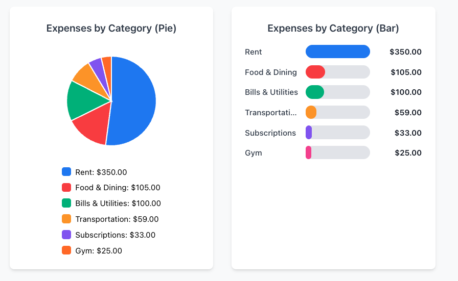

# Expense Tracker

A full-stack expense tracking application built with FastAPI (Python), React TypeScript, and PostgreSQL. Features comprehensive expense management, income tracking, and financial analytics with interactive charts.

## Features

- User authentication with JWT tokens
- Expense and income management with date selection
- 20+ expense categories with visual analytics
- Interactive pie charts and proportional bar charts
- Monthly navigation and financial insights
- Responsive design with Tailwind CSS

## Tech Stack

- **Backend**: Python FastAPI with SQLAlchemy ORM
- **Frontend**: React with TypeScript and Tailwind CSS
- **Database**: PostgreSQL
- **Deployment**: Docker and Docker Compose

## Quick Start

1. Clone the repository
2. Run with Docker:
   ```bash
   docker-compose up --build
   ```
3. Access the application:
   - Frontend: [http://localhost:3000](http://localhost:3000)
   - Backend API: [http://localhost:8000](http://localhost:8000)
   - API Documentation: [http://localhost:8000/docs](http://localhost:8000/docs)

## Screenshots

### Landing Page


### Authentication
| Register | Login |
|----------|-------|
|  |  |

### Dashboard


### Expense Management
| Add Expense | Add Income |
|-------------|------------|
|  |  |

### Analytics



- Real-time financial insights and balance calculations
- Beautiful, responsive web interface with Tailwind CSS
- Smart routing with protected dashboard and public landing page
- Month-based expense filtering and categorization
- Edit and delete functionality for all expense entries

## Quick Start

1. Clone the repository
2. Run with Docker:
   ```bash
   docker-compose up --build
   ```
3. Access the application:
   - Frontend: [http://localhost:3000](http://localhost:3000)
   - Backend API: [http://localhost:8000](http://localhost:8000)
   - API Documentation: [http://localhost:8000/docs](http://localhost:8000/docs)

## Environment Variables

Create a `.env` file in the root directory:

```env
DATABASE_URL=postgresql://user:password@db:5432/expense_tracker
SECRET_KEY=your-super-secure-secret-key
ALGORITHM=HS256
ACCESS_TOKEN_EXPIRE_MINUTES=30
```

## API Endpoints

- `POST /api/auth/register` - Register a new user
- `POST /api/auth/token` - Login and get access token
- `GET /api/expenses/` - Get user's expenses
- `POST /api/expenses/` - Create a new expense
- `PUT /api/expenses/{id}` - Update an expense
- `DELETE /api/expenses/{id}` - Delete an expense
- `GET /api/expenses/categories/` - Get expense categories
- `GET /api/salaries/` - Get user's income records